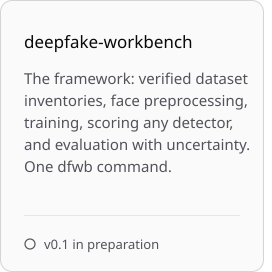
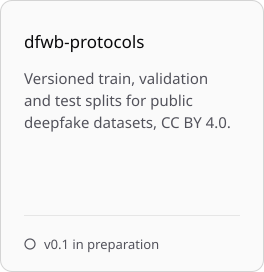
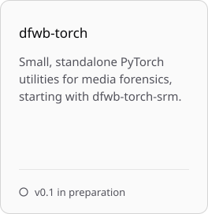

<picture>
  <source media="(prefers-color-scheme: dark) and (max-width: 600px)" srcset="assets/hero-dark-compact.svg">
  <source media="(prefers-color-scheme: light) and (max-width: 600px)" srcset="assets/hero-light-compact.svg">
  <source media="(prefers-color-scheme: dark)" srcset="assets/hero-dark.svg">
  
</picture>

### Packages

<!-- PACKAGES:START -->
The first releases are in preparation. Each repository opens with its v0.1 release.

<picture><source media="(prefers-color-scheme: dark)" srcset="assets/deepfake-workbench-dark.svg"></picture>
<picture><source media="(prefers-color-scheme: dark)" srcset="assets/dfwb-protocols-dark.svg"></picture>
<picture><source media="(prefers-color-scheme: dark)" srcset="assets/dfwb-torch-dark.svg"></picture>

<!-- PACKAGES:END -->

### Principles

**Never media.** We publish identifiers, labels and splits, never the videos, frames or audio. You get each dataset from its owner, under the owner's terms.

**Reproducible by default.** Inventories are checked against sha256, splits are versioned, runs are seed-locked, and results carry confidence intervals. [RESPONSIBLE_USE.md](https://github.com/dfwb-research/.github/blob/main/RESPONSIBLE_USE.md) covers the rest.

### Datasets and detectors

<!-- TABLES:START -->
The dataset and detector tables are populating with v0.1.
<!-- TABLES:END -->

### Cite this work

<!-- CITE:START -->
Each package repository carries a `CITATION.cff`, so GitHub's "Cite this repository" button gives you the reference once the repository is public.
<!-- CITE:END -->

### Maintainer

<!-- PEOPLE:START -->
<a href="https://github.com/lukegcollins"><picture><source media="(prefers-color-scheme: dark)" srcset="assets/maintainer-dark.svg"></picture></a>

Maintained by Luke Collins, Deakin University ([ORCID 0009-0002-7771-1081](https://orcid.org/0009-0002-7771-1081)). [Supported by Dynamis Labs](https://dynamislabs.com.au). Contributions are welcome: see [CONTRIBUTING](https://github.com/dfwb-research/.github/blob/main/CONTRIBUTING.md).
<!-- PEOPLE:END -->

<!-- STATUS:START -->

<samp>status verified 2026-09-25</samp>

<!-- STATUS:END -->
